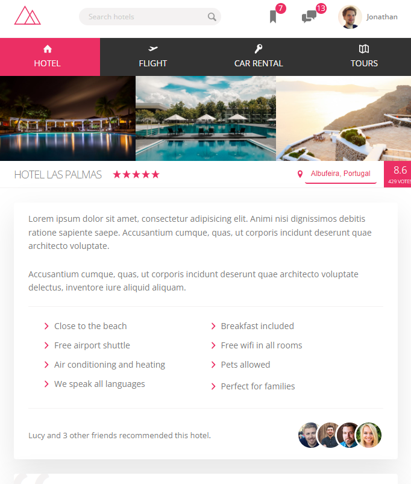

# Trillo

_**What is Trillo project ?** Trillo is a landing website for booking hotel on your holiday. You can visit the site by clicking the link &rarr;[Trillo](https://trillo-gldn.netlify.app/)_
 

### What did I learn while coding these project ?

_In this project I used mostly flexbox and work on animations. Also I practiced BEM (Block Element Modifier) and SCSS 😀._

> #
>
> - _what is flex, flex-container, flex-item ? ,_
> - _how to align flex-items vertically and horizontally,_
> - _how to declare css custom propery in :root class,_
> - _how to declare SaaS variables,_
> - _how to use linear-gradient() function on background-image,_
> - _flex shortcut and logic behind flex-grow, flex-shrink and flex-basis,_
> - _flex-wrap to build a multi-column list,_
> - _work with svg icons and color them according to currentcolor parameter,_
> - _work with transform property in css,_
> - _power of margin-left:auto, margin-right:auto,_
> - _how to add margin-bottom except for last item with :not(:last-child) CSS pseudo-class,_
> - _positioning ::before and ::after pseudo-element with position:absolute,_
> - _describing different transition properties for different animation,_
> - _working with cubic-bezier() function to describe transition function,_
> - _how animation is defined with @keyframes,_
> - _how and why to use CSS masks with mask-image and mask-size,_
> - _how to media queries is written according to desktop first approach_
>
> #

 

 
 

 
 

